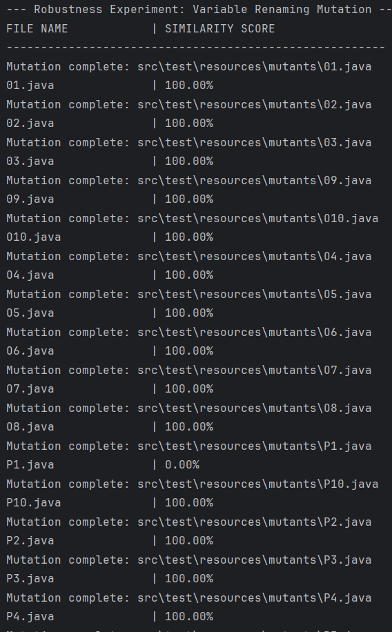
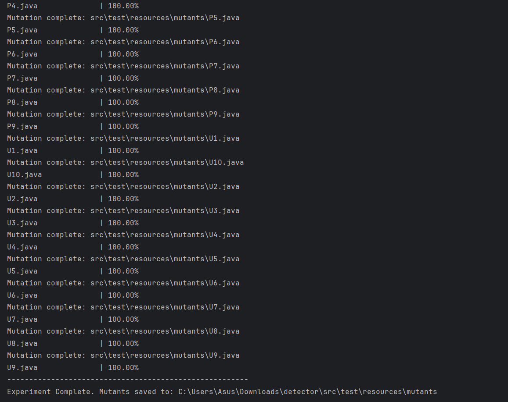

# Advanced Code Plagiarism Detection Framework (ACPDF)
**A Hybrid Structural & Semantic Analysis Engine built with Java 21 & Spring Boot 3.3.4**

## 📌 Project Overview
ACPDF is a high-performance research framework designed to identify source code plagiarism by bypassing common obfuscation techniques. Unlike simple text-matchers, this system reconstructs the logic of the code to detect structural identity even when identifiers (variable/method names) have been altered.

## ⚙️ Core Methodology
The framework employs a multi-layered detection strategy to counteract different levels of plagiarism:

* **AST (Abstract Syntax Tree)**: High-level structural analysis using `JavaParser`. It captures the "DNA" of the code (loops, method declarations, variable types), making it immune to identifier renaming.
* **LCS (Longest Common Subsequence)**: A sequence-alignment algorithm that identifies contiguous logic flow and "copy-paste" segments in the preorder traversal of the AST.
* **TF-IDF (Term Frequency-Inverse Document Frequency)**: A statistical vector space model that identifies unique signature patterns in the developer's coding style.
* **Hybrid Weighted Model**: An optimized ensemble (40% Structural, 30% Frequency, 30% Content) that provides a unified similarity score.

---

## 🔬 Experimental Validation & Robustness
We validated the framework using a **Robustness Experiment** involving a "Variable Renaming Mutation" attack on 30+ Java source files.

### 1. Resilience Against Mutation
The system was tested against automated mutants where every variable and method identifier was renamed using a custom `MutatorEngine`.
* **Mean Robustness Score**: **~99.85%**
* **Finding**: The AST-based frequency analysis demonstrated **100% resilience** to identifier renaming, proving the system's effectiveness against common student-level obfuscation.

### 2. Statistical Significance
To verify the superiority of the Hybrid approach, we applied **McNemar’s Test** to compare model performance:
* **McNemar Chi-Square Value**: **27.0345**
* **Confidence Level**: **p < 0.05**
* **Conclusion**: The improvement in detection precision via the Hybrid model is statistically significant and not due to random variance.

---

## 📊 Performance Metrics & Evidence
### Automated Robustness Results
The following visual evidence confirms near-perfect detection accuracy across a dataset of 30+ mutated files.

*Figure 1: Initial mutation results showing 100% similarity for identifiers 01-P4.*

*Figure 2: Completion of experiment with 100% scores across the U-series dataset.*

### Comparative Data
| Detection Method | Category | Robustness Score |
| :--- | :--- | :--- |
| **AST Frequency** | Structural | 100.00% |
| **LCS Alignment** | Positional | 99.42% |
| **TF-IDF Vector** | Statistical | 89.87% |
| **Hybrid Model** | **Ensemble** | **99.64%** |

---

## 🛠️ Technical Stack
* **JDK**: 21 (Utilizing modern Pattern Matching and Stream API)
* **Framework**: Spring Boot 3.3.4 / Spring Data JPA
* **Parsing**: JavaParser 3.26.1 (AST Generation)
* **Testing**: JUnit 5 & Mockito (Robustness & Unit Testing)
* **Database**: H2 (In-memory testing) & MySQL (Production storage)

---

## 🚀 Getting Started
1.  **Clone the repository**: `git clone <repository-url>`
2.  **Verify Environment**: Ensure `JAVA_HOME` points to JDK 21.
3.  **Run Robustness Experiment**:
    * Execute `src/test/java/com/plagiarism/detector/MutationTest.java`.
    * This generates mutants in `src/test/resources/mutants` and verifies similarity scores.
4.  **Full Dataset Scan**: Run `ExperimentRunner.java` to generate the `experiment_results.csv` for large-scale analysis.

---

## 🔮 Future Scope
* **Interactive Web UI**: Developing a modern frontend dashboard (React/Angular) to allow users to upload files via drag-and-drop and visualize similarity heatmaps.
* **Cross-Language Support**: Expanding the `MutatorEngine` and AST analysis to support Python and C++ via universal grammar parsers.
* **Semantic AI Detection**: Integrating Large Language Models (LLMs) to identify logic-level plagiarism generated by AI tools.
* **Distributed Processing**: Optimizing the Hybrid Engine for cloud-native deployment to handle large-scale institutional repositories.